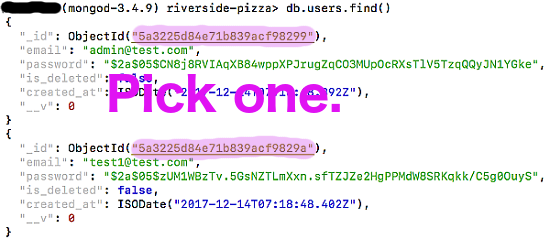

# Riverside Pizza's Source Code

  This repository holds the source code to [https://www.manitowocsriversidepizza.com](https://www.manitowocsriversidepizza.com) that is built with
  **NodeJS/Express/MongoDB**.

## Found a bug?

  1. File an issue if none is issued.
  2. Fix and make a pull request.

# Contributing

  I welcome any pull request from any Javascript developer.  Plus if you would like, your contribution will be shown on here.  Thank you.

## Before you Begin

  * You must have the following prerequisites installed:
    * [Node.js](https://nodejs.org/) runtime v7.7.4 or greater (including the npm package manager)
    * [MongoDB](https://docs.mongodb.com/v3.4/installation/) database

  * The following is not required to start up:
    * Have a [Stripe](https://stripe.com) account with a publishable API test key and secret API test key.  To register for a free Stripe account, go to https://dashboard.stripe.com/register.  Stripe handles online transactions.
    * Have a [Google reCAPTCHA](https://google.com/recaptcha/intro/android.html) account with a publishable API key and secret API key.  To register for a free Google reCaptcha account, go to https://www.google.com/recaptcha/intro/android.html.  Google reCAPTCHA is a free service that protects your website from spam and abuse.

  * For testing check out and adding new orders:
    * Try using the test card number 4242 4242 4242 4242, a random three-digit CVC number, any expiration date in the future, and a random five-digit U.S. ZIP code.

## Steps to Run Locally

Perform steps 1-4:

  1. [Clone the Repo](#1-clone-the-repo)
  2. [Add Data to Database](#2-add-data-to-database)
  3. [Edit Files and Create .env File](#3-edit-files-and-create-env-file)
  4. [Run the Web Application](#4-run-the-web-application)

### 1. Clone the Repo

  **Clone** `riverside-pizza` locally. In a terminal, run:

  `$ git clone https://github.com/Luehang/riverside-pizza.git riverside-pizza`

### 2. Add Data to Database

  Navigate into the ``riverside-pizza/seed`` directory and run the following to add the necessary data...

  ```
  $ cd riverside-pizza/seed
  $ node chili-seeder.js
  $ node drink-seeder.js
  $ node item-seeder.js
  $ node promo-seeder.js
  ```

  Enter this for testing purposes...

  ```
  $ node user-seeder.js
  ```

### 3. Edit Files and Create .env File

  * Find the main ``app.js`` file and skim through it to find the **development logger** for **debugging**.  Uncomment the highlighted code below.

    

  * Navigate into ``public/javascripts/checkout.js`` and look above the javascript file.  You should see Stripe's "**setPublishableKey**."  Enter in your **publishable test key** here...

    

  * After that, locate the user's ``signup.hbs`` in ``views/user/`` and replace the present key with your own Google's reCAPTCHA **publishable key** as shown here on this image.

    

  * Modify ``env.contributing``'s name to ``.env`` and populate the service
  credentials as you create the credentials:

    ```
    # Stripe's API Key at https://www.stripe.com
    STRIPE_SECRET_KEY=<put Stripe's Secret Test Key here>

    # Google's reCaptcha V2 API Key
    RECAPTCHA_SECRET_KEY=<put Google's reCaptcha Secret Key here>
    ```

  * Add a user's ``_id`` to the ``ADMIN`` environment variable by navigating into the the ``users`` **collection** in the ``riverside-pizza`` **database** as shown below.

    

    ```
    # User's _id for admin account (obtain in MongoDB)
    ADMIN=<put User's _id here>
    ```

  * Add a **random phrase** for the environment variable, ``SESSION_SECRET``.

    ```
    SESSION_SECRET=<put session secret phrase here>
    ```

### 4. Run the Web Application

  Enter the following while in the ``riverside-pizza/`` directory to run the app locally...

  ```
  $ npm install
  $ npm start
  ```

  Application will run default at **localhost:5000**...

  **Thank you for contributing and happy coding!**

# License

  [Apache 2.0](LICENSE)